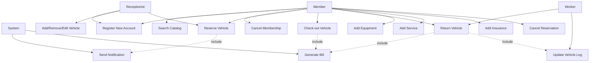
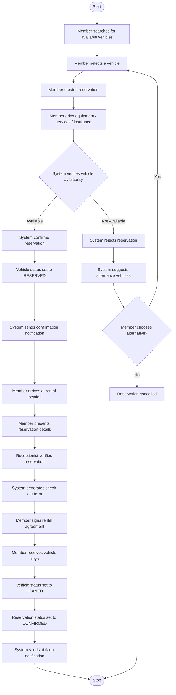
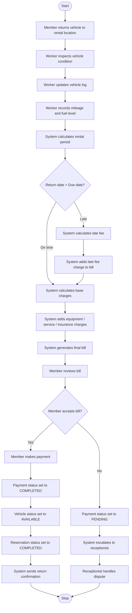
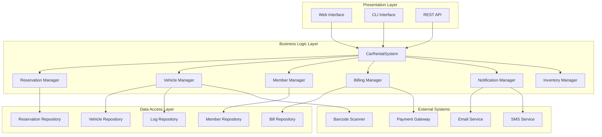
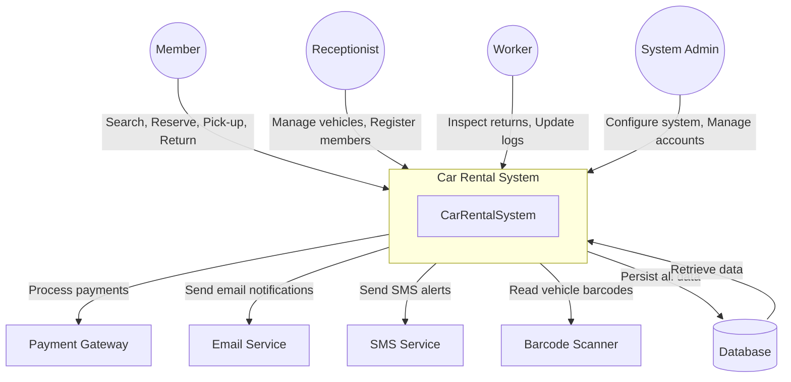
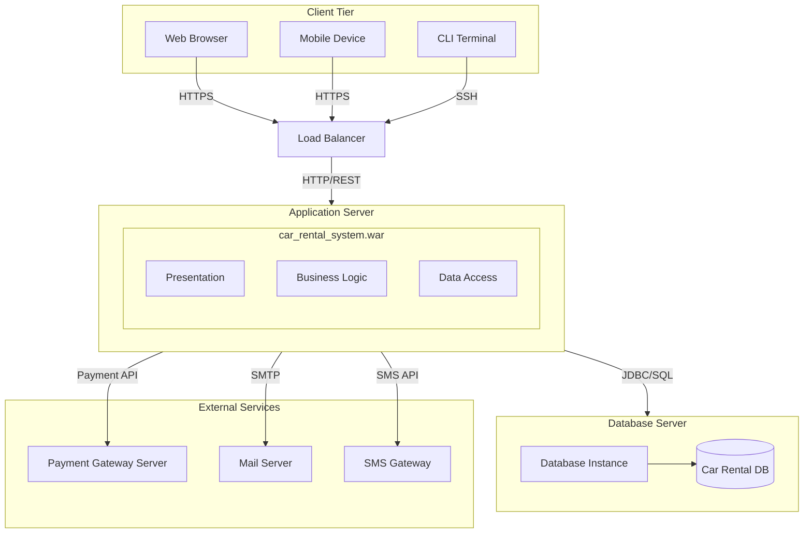

# Car Rental System - Diagramas

## Use Case Diagram

## Class Diagram

## Activity Diagram: Pick Up a Vehicle

## Activity Diagram: Return a Vehicle

## Component Diagram

## Context Diagram

## Package / Development Diagram

```mermaid
graph TB
    subgraph car_rental_system["car_rental_system"]
        subgraph models["models"]
            Address
            Person
            Account
            Member
            Receptionist
            AdditionalDriver
            Vehicle
            Car
            Van
            Truck
            SUV
            Motorcycle
        end

        subgraph enums["enums"]
            BillItemType
            VehicleLogType
            VehicleStatus
            ReservationStatus
            AccountStatus
            PaymentStatus
            CarType
            VanType
        end

        subgraph services["services"]
            CarRentalSystem
            VehicleInventory
            VehicleReservation
        end

        subgraph business["business"]
            Bill
            BillItem
            Equipment
            Service
            RentalInsurance
            Notification
            VehicleLog
        end

        subgraph ui["ui"]
            main
        end
    end

    enums -.->|import| models
    services -.->|import| models
    services -.->|import| enums
    business -.->|import| models
    business -.->|import| enums
    ui -.->|import| services
    ui -.->|import| business
    ui -.->|import| models
```

## Deployment Diagram

## Archivos PlantUML

Los diagramas en formato PlantUML estan disponibles en la carpeta `diagrams/`:

| Diagrama | Archivo |
|----------|---------|
| Use Case | `diagrams/use_case_diagram.puml` |
| Class | `diagrams/class_diagram.puml` |
| Activity - Pick Up | `diagrams/activity_pickup.puml` |
| Activity - Return | `diagrams/activity_return.puml` |
| **Component** | `diagrams/component_diagram.puml` |
| **Context** | `diagrams/context_diagram.puml` |
| **Development/Package** | `diagrams/development_diagram.puml` |
| **Deployment** | `diagrams/deployment_diagram.puml` |

Puedes renderizarlos con [PlantUML](https://plantuml.com/) o con extensiones de VS Code como `PlantUML Preview`.

---

> **Nota:** No puedo procesar archivos de imagen directamente. Los diagramas han sido creados en formato **PlantUML** (`.puml`) y **Mermaid.js** (en este archivo), los cuales se renderizan automáticamente en GitHub y en editores con soporte para estos formatos.
