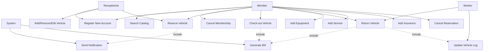
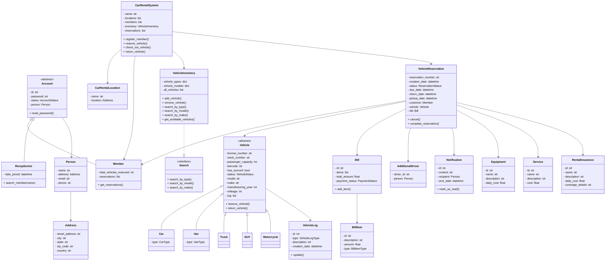

# Car Rental System - Diagramas

## Use Case Diagram

## Class Diagram

## Activity Diagram: Pick Up a Vehicle

## Activity Diagram: Return a Vehicle

## Archivos PlantUML

Los diagramas en formato PlantUML estan disponibles en la carpeta `diagrams/`:

- `diagrams/use_case_diagram.puml`
- `diagrams/class_diagram.puml`
- `diagrams/activity_pickup.puml`
- `diagrams/activity_return.puml`

Puedes renderizarlos con [PlantUML](https://plantuml.com/) o con extensiones de VS Code como `PlantUML Preview`.
